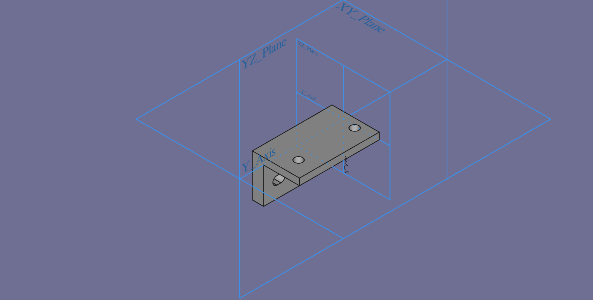
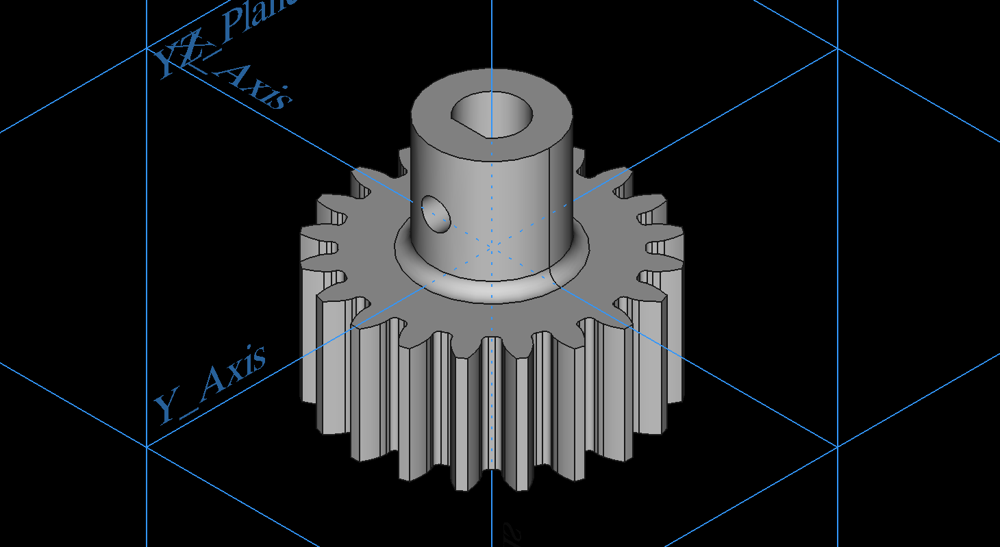
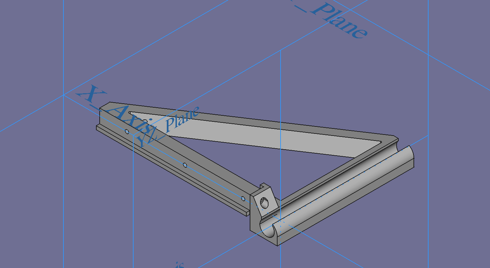
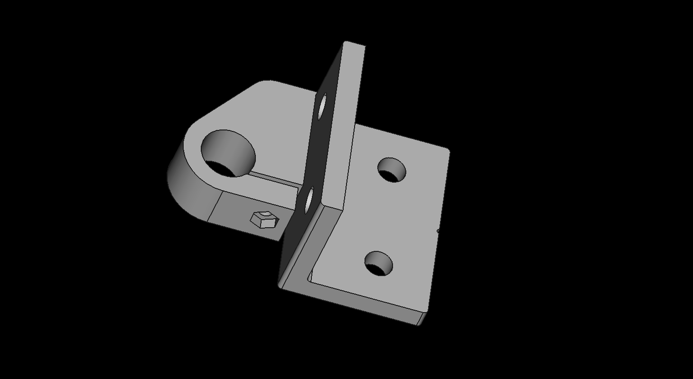

# Metalværksted Seniorhus Odense 3D printer  
## Baseret på Scott Alford's [HyperCube Evolution](https://www.thingiverse.com/thing:2254103)  

# Matrialer:
## 3030 and 2020 extrusion

## Fasteners

## Motors
5 x [NEMA 17 42mm Stepper Motors](https://www.amazon.de/gp/product/B07STSYWY6/ref=ppx_yo_dt_b_asin_title_o08_s00?ie=UTF8&psc=1)  

## Lead Screw M8 
1 x [Leitspindel+CopperMutter+VertikallagerLager+Kupplung (1Set)](https://www.amazon.de/gp/product/B07LDZPSKL/ref=ppx_yo_dt_b_asin_title_o06_s02?ie=UTF8&psc=1)  

## Pulleys and Belts
5m Polyurethane GT2 6mm belt &   
2 x [GT2 Timing Pulley (20 teeth) 5mm bore for 6mm belt](https://www.amazon.de/gp/product/B06XKVX3FY/ref=ppx_yo_dt_b_asin_title_o08_s00?ie=UTF8&psc=1)  
6 x [GT2 Idler Pulley (20 teeth) 3mm bore](https://www.amazon.de/gp/product/B07K8FNGCZ/ref=ppx_yo_dt_b_asin_title_o06_s01?ie=UTF8&psc=1)  
2 x [GT2 Idler Pulley without teeth (20 teeth) 3mm bore](https://www.amazon.de/gp/product/B083RCTF7T/ref=ppx_yo_dt_b_asin_title_o05_s00?ie=UTF8&psc=1)  

## Linear Bearings  
4 x LM12UU 12mm Linear Ball Bearings  
4 x LM10UU 10mm Linear Ball Bearings or 2 x LM10LUU 10mm Long Linear Ball Bearings  
4 x LM8UU 8mm Linear Ball Bearings  

## Heated Bed components
1 x [Print Bed Rubber Heater 408 x 408 mm](https://3dstore.dk/tilbehoer/reservedele/creality-3d/cr10s/print-bed-rubber-heater-408-x-408-mm/) 
  
1 x [PrimaCreator FlexPlate PEI 410 x 410 mm](https://3dstore.dk/tilbehoer/print-surface/primacreator-flexplate-pei-410-x-410-mm/)
1 x Aluplate 430x430x3 mm

## HotEnd:
1 x [E3D v6 HotEnd Full Kit - 1.75mm Bowden (24v)](https://filament23d.dk/e3d-v6-hotend-full-kit-1-75mm-bowden-24v-da.html) - **[Assembly Guid](https://wiki.e3d-online.com/E3D-v6_Assembly)**  
1 x [24V Blow 50mm](https://filament23d.dk/24v-blow-50mm-da.html)  
1 x [Extruder](https://www.amazon.de/gp/product/B07TJ8PB7D/ref=ppx_yo_dt_b_asin_title_o07_s00?ie=UTF8&psc=1
)

## Control System
1 x [24V 400W power supply](https://www.amazon.de/gp/product/B01G257UHW/ref=ppx_yo_dt_b_asin_title_o02_s00?ie=UTF8&psc=1)  
1 x [BIGTREETECH-SKR-V1.4](https://github.com/bigtreetech/BIGTREETECH-SKR-V1.3/tree/master/BTT%20SKR%20V1.4)  
1 x [BIGTREETECH-TFT35-V3.0](https://github.com/bigtreetech/BIGTREETECH-TFT35-V3.0)  
1 x [BIGTREETECH-MINI-UPS-V2.0](https://github.com/bigtreetech/BIGTREETECH-MINI-UPS-V2.0/tree/master/BTT%20UPS%2024V%20V1.0)  
5 X [BIGTREETECH-TMC2130-V3.0](https://github.com/bigtreetech/BIGTREETECH-TMC2130-V3.0)  
1 x [ESP-01S WIFI Module ESP8266 For SKR](https://www.biqu.equipment/products/esp-01s-wifi-module-esp8266-for-skr-pro)  

# 3D-Printede Dele: 
* [FreeCad (FCStd) filer & STL filer kan hentest her](https://github.com/mstedet/Hypercube/tree/master/FreeCad)  
## 3030 Profiler
4 x EndCap_3030 - **[STL-fil](/FreeCad/3030/EndCap_3030.stl)** - **[FreeCad-fil](/FreeCad/3030/EndCap_3030.FCStd)**
 
4 x FodBund 3030 - **[STL-fil](/FreeCad/3030/Foot-30a.stl)** - **[FreeCad-fil](/FreeCad/3030/Foot-30a.FCStd)**
 
4 x FodJustermøtrik - **[STL-fil](/FreeCad/3030/Foot-30b.stl)** - **[FreeCad-fil](/FreeCad/3030/Foot-30b.FCStd)**
 

## X-Axel
2 x X-Axel-Battery-Dummy  
1 x X-Axel-Bearing_A   
1 x X-Axel-Bearing_B   
2 x X-Axel-Belt-Tension  
1 x X-Axel-Printhead-Base

## Y-Axel
2 x Afstandstykke_2mm   
2 x Y-Axel-Bearing_A 
2 x Y-Axel-Bearing_B 

## Z-Axel
1 x GearHolder_002 

1 x GearHolderBottom 

1 x GearWheel 20 Tand - **[STL-fil](/FreeCad/Z-Axel/Gear+Motor/GearWheel_20_001.stl)** - **[FreeCad-fil](/FreeCad/Z-Axel/Gear+Motor/GearHolder/GearHolderBottom_20_001.FCStd)** 
  

1 x GearWhell 80 Tand   

2 x Z-Axel-Bearing_020_000   

2 x Z_Axis_Linear_Rail_Bracket_0300   

1 x Z_Nut_Braket_1.1

## Drag Chain
1 x Chain Start  
20 x Chain Top - **[STL-fil](/FreeCad/DragChain/DragChainTop_22.5.stl)** - **[FreeCad-fil](/FreeCad/DragChain/DragChainTop_22.5.FCStd)** 

20 x Chain Bund - **[STL-fil](/FreeCad/DragChain/DragChainBund_22.5.stl)** - **[FreeCad-fil](FreeCad/DragChain/DragChainBund_22.5.FCStd)**
 
1 x Chain Slut  

# Calibrate
## Calibrate the Extruder
* DrVax
  * [Calibrate Your 3d Printer Extruder](https://www.youtube.com/watch?v=lRoCwxRZsvU)
  * [Calibrating your Extruder and Adjusting Flow Rate](https://docs.google.com/presentation/d/1wpuLDlLARoFbS7apN1uDdRoSiFpWugTFrTnqUJ-ni_s/edit#slide=id.gc6f9e470d_0_0)
* Thomas Sanladerer
  * [How To Calibrate the Extruder Steps (Ender-3 / Ender-5 / CR-10)](https://letsprint3d.net/how-to-calibrate-the-extruder-steps-ender-3-5-cr-10/)
## Printing Speed
* Thomas Sanladerer
  * [3D printing guides - Tuning speeds](https://www.youtube.com/watch?v=7HsIZuj9vOs)  
  * 