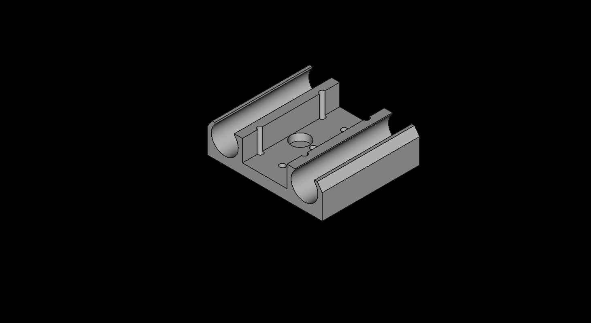
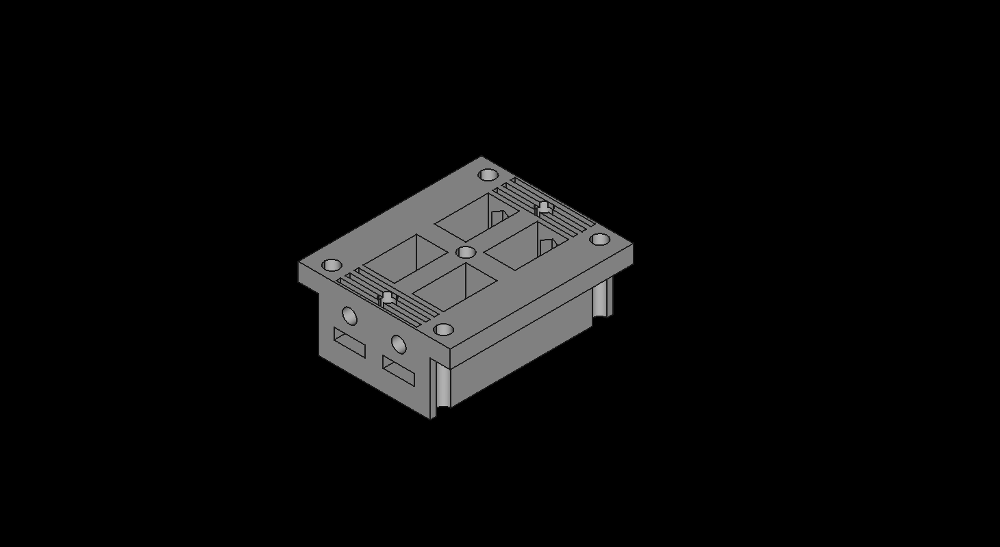
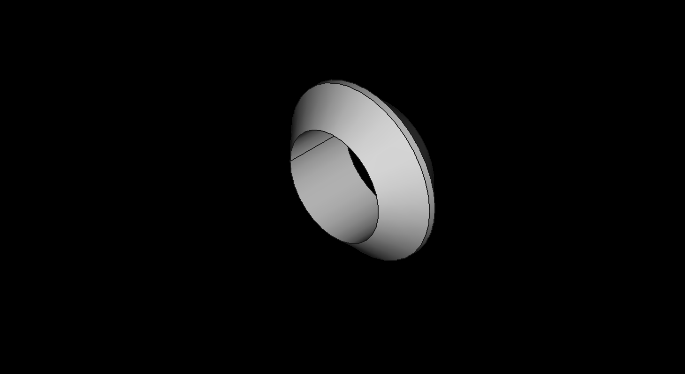
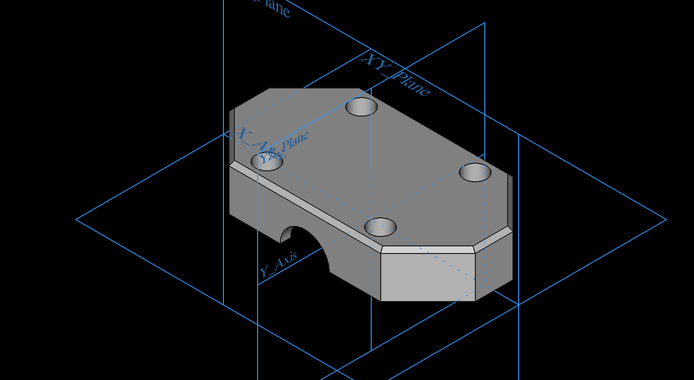
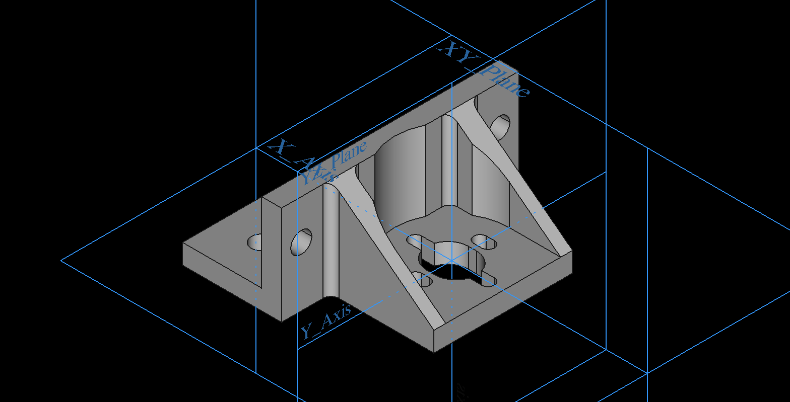

# Metalværksted Seniorhus Odense 3D printer  
## Baseret på Scott Alford's [HyperCube Evolution](https://www.thingiverse.com/thing:2254103)  

# Matrialer:
## [Item Aluminiumsprofiler 3030 and 2020 extrusion](https://www.linearmodul.dk/sida5_dk.html)
15 Meter [Profil 6 30x30 leicht, natur](https://product.item24.de/directlink/de/pro/41906)  

150 x [Notsten 6 St M6](https://www.linearmodul.dk/)   
50 x  Notsten Not 5, M5 svingbar m.skaft St.FZB  

100 x [Standard-Fastening Set 6 E, bright zinc-plated](https://product.item24.de/produkte/produktkatalog/produktdetails/products/standard-verbindungssaetze-1001012015/standard-verbindungssatz-6-e-verzinkt-64865/)   
 -   
### item Konstruktionsprofile 5
[3 meter Profil 5 20x20, natur 0.0.370.03](https://product.item24.de/produkte/produktkatalog/produktdetails/products/konstruktionsprofile-5-1001042368/profil-5-20x20-natur-37003/)  

## Bolte 
* 500 stk M6x12 DIN EN ISO 7380-1, Button head screw, Stainless steel A2-70  

* 500 stk M5x10 DIN EN ISO 7380-1, Button head screw, Galvanized 10.9 steel  
 
  

* 500 stk M5x10 DIN 912, ISO 4762 ZYLINDERSCHRAUBE MIT INNENSECHSKANT UND UNTERKOPFVERZAHNUNG M5 x 10

* 50 stk M3 x 20 

## Axeler 
1 Meter [Aksel ø8  h6 - Hærdet & slebet dia.  8 mm (HL=6m)](https://www.linearmodul.dk/)  
1 Meter [Aksel ø10 h6 - hærdet & slebet dia. 10 mm (HL=6m)](https://www.linearmodul.dk/)  
4 Meter [Aksel ø12 h6 - hærdet & slebet dia. 12 mm (HL=6m)](https://www.linearmodul.dk/)  

## Motors
5 x [NEMA 17 42mm Stepper Motors](https://www.amazon.de/gp/product/B07STSYWY6/ref=ppx_yo_dt_b_asin_title_o08_s00?ie=UTF8&psc=1)  

## Lead Screw M8 
2 x [Leitspindel+CopperMutter+VertikallagerLager+Kupplung (1Set)](https://www.amazon.de/gp/product/B07LDZPSKL/ref=ppx_yo_dt_b_asin_title_o06_s02?ie=UTF8&psc=1)  
[her er andre modeller fra aliexpress.com](https://www.aliexpress.com/item/32507277503.html?spm=a2g0o.cart.0.0.331e3c00jh9G45&mp=1) 
  
eller   

2 x [CNC 3D Printer THSL-300-8D Trapezoidal Rod T8 Lead Screw Thread 8mm Lead 1mm Length 600mm with Brass Nut](https://www.aliexpress.com/item/32507277503.html?spm=a2g0o.cart.0.0.590f3c00qjklE0&mp=1)  
4 x [KP08 Bearing Shaft Support Spherical Roller Zinc Alloy Mounted Bearings Pillow Block Housing](https://www.aliexpress.com/item/32571310602.html?spm=a2g0o.cart.0.0.590f3c00qjklE0&mp=1)  
  

## Pulleys and Belts
5m Polyurethane GT2 6mm belt &   
2 x [GT2 Timing Pulley (20 teeth) 5mm bore for 6mm belt](https://www.amazon.de/gp/product/B06XKVX3FY/ref=ppx_yo_dt_b_asin_title_o08_s00?ie=UTF8&psc=1)  
6 x [GT2 Idler Pulley (20 teeth) 3mm bore](https://www.amazon.de/gp/product/B07K8FNGCZ/ref=ppx_yo_dt_b_asin_title_o06_s01?ie=UTF8&psc=1)  
2 x [GT2 Idler Pulley without teeth (20 teeth) 3mm bore](https://www.amazon.de/gp/product/B083RCTF7T/ref=ppx_yo_dt_b_asin_title_o05_s00?ie=UTF8&psc=1)  

## Linear Bearings  
8 x LM12UU 12mm Linear Ball Bearings  eller [Linear Ball Bearings LM12LUU 12 Part Bush Bushing 3D Printers Parts Aluminum Accessories](https://www.aliexpress.com/item/4000586376717.html?spm=a2g0o.productlist.0.0.5fb74450LOA5DN&algo_pvid=497252ef-cf79-4313-bd97-9c2e9ce2ef34&algo_expid=497252ef-cf79-4313-bd97-9c2e9ce2ef34-0&btsid=0be3743615871218685115454e75b1&ws_ab_test=searchweb0_0,searchweb201602_,searchweb201603_)  
4 x LM10UU 10mm Linear Ball Bearings or 2 x LM10LUU 10mm Long Linear Ball Bearings  
4 x LM8UU 8mm Linear Ball Bearings  

## Heated Bed components
1 x [Print Bed Rubber Heater 408 x 408 mm](https://3dstore.dk/tilbehoer/reservedele/creality-3d/cr10s/print-bed-rubber-heater-408-x-408-mm/) 
  
1 x [PrimaCreator FlexPlate PEI 410 x 410 mm](https://3dstore.dk/tilbehoer/print-surface/primacreator-flexplate-pei-410-x-410-mm/)
1 x Aluplate 430x430x3 mm

## HotEnd:
1 x [E3D v6 HotEnd Full Kit - 1.75mm Bowden (24v)](https://filament23d.dk/e3d-v6-hotend-full-kit-1-75mm-bowden-24v-da.html) - **[Assembly Guid](https://wiki.e3d-online.com/E3D-v6_Assembly)**  
1 x [24V Blow 50mm](https://filament23d.dk/24v-blow-50mm-da.html)  
1 x [Extruder](https://www.amazon.de/gp/product/B07TJ8PB7D/ref=ppx_yo_dt_b_asin_title_o07_s00?ie=UTF8&psc=1
)

## Control System
1 x [24V 400W power supply](https://www.amazon.de/gp/product/B01G257UHW/ref=ppx_yo_dt_b_asin_title_o02_s00?ie=UTF8&psc=1)  
1 x [BIGTREETECH-SKR-V1.4](https://github.com/bigtreetech/BIGTREETECH-SKR-V1.3/tree/master/BTT%20SKR%20V1.4)  
1 x [BIGTREETECH-TFT35-V3.0](https://github.com/bigtreetech/BIGTREETECH-TFT35-V3.0)  
1 x [BIGTREETECH-MINI-UPS-V2.0](https://github.com/bigtreetech/BIGTREETECH-MINI-UPS-V2.0/tree/master/BTT%20UPS%2024V%20V1.0)  
5 X [BIGTREETECH-TMC2130-V3.0](https://github.com/bigtreetech/BIGTREETECH-TMC2130-V3.0)  
1 x [ESP-01S WIFI Module ESP8266 For SKR](https://www.biqu.equipment/products/esp-01s-wifi-module-esp8266-for-skr-pro)  

# 3D-Printede Dele: 
## Filament:
2 x [Spectrum Filaments – PLA – 1.75mm – Deep Black – 1 kg](https://3dstore.dk/filament/spectrum-filaments-pla-1-75mm-deep-black-1-kg/)  
2 x [Spectrum Filaments – PLA – 1.75mm – Dark Grey – 1 kg](https://3dstore.dk/filament/spectrum-filaments-pla-1-75mm-dark-grey-1-kg/)  
2 x [Spectrum Filaments – PLA – 1.75mm – Navy Blue – 1 kg](https://3dstore.dk/filament/spectrum-filaments-pla-1-75mm-navy-blue-1-kg/)  
2 x [Spectrum Filaments – PLA – 1.75mm – Bloody Red – 1 kg](https://3dstore.dk/filament/spectrum-filaments-pla-1-75mm-bloody-red-1-kg/)  
## PrintaFix:
3 x [APRINTAPRO PrintaFix Basic 100ml](https://3dstore.dk/tilbehoer/printafix/aprintapro-printafix-basic/)  
## Filer:
* [FreeCad (FCStd) filer & STL filer kan hentest her](https://github.com/mstedet/Hypercube/tree/master/FreeCad)  
## 3030 Profiler
4 x EndCap_3030 - **[STL-fil](/FreeCad/3030/EndCap_3030.stl)** - **[FreeCad-fil](/FreeCad/3030/EndCap_3030.FCStd)**
 
4 x FodBund 3030 - **[STL-fil](/FreeCad/3030/Foot-30a.stl)** - **[FreeCad-fil](/FreeCad/3030/Foot-30a.FCStd)**
 
4 x FodJustermøtrik - **[STL-fil](/FreeCad/3030/Foot-30b.stl)** - **[FreeCad-fil](/FreeCad/3030/Foot-30b.FCStd)**
 

## X-Axel
2 x X-Axel-Battery-Dummy  
1 x X-Axel-Bearing_A   
1 x X-Axel-Bearing_B   
2 x X-Axel-Belt-Tension  
1 x X-Axel-Printhead-Base

## Y-Axel
2 x Afstandstykke_2mm - **[STL-fil](/FreeCad/Y-Axel/Afstandstykke_2mm/Afstandstykke_2mm.stl)** - **[FreeCad-fil](/FreeCad/Y-Axel/Afstandstykke_2mm/Afstandstykke_2mm.FCStd)**
  
2 x Y-Axel-Bearing_A - **[STL-fil](FreeCad/Y-Axel/Y-Axel-Bearing_007/Y-Axel-Bearing_007a.stl)** - **[FreeCad-fil](/FreeCad/Y-Axel/Y-Axel-Bearing_007/Y-Axel-Bearing_007a.FCStd)**
 
2 x Y-Axel-Bearing_B  - **[STL-fil](FreeCad/Y-Axel/Y-Axel-Bearing_007/Y-Axel-Bearing_007b.stl)** - **[FreeCad-fil](/FreeCad/Y-Axel/Y-Axel-Bearing_007/Y-Axel-Bearing_007b.FCStd)**
 

## Z-Axel
* 4 x Z-Axel-Bearing_1010a  
  * 2 x venstre  
  * 2 x højre (venstre spejlet i cura)  

  

* 4 x Z-Axel-Bearing_1001b  

  

* 8 x Z-Bracket_1001  
  * 4 x venste  
  * 4 x højre (venstre spejlet i cura)  

  

* 2 x Z-KP08_Holder_1010  

  

* 2 x Z-Motor_Holder

  

* 2 x trapezewagon-1001  

  

## Drag Chain
1 x Chain Start  
20 x Chain Top - **[STL-fil](/FreeCad/DragChain/DragChainTop_22.5.stl)** - **[FreeCad-fil](/FreeCad/DragChain/DragChainTop_22.5.FCStd)** 

20 x Chain Bund - **[STL-fil](/FreeCad/DragChain/DragChainBund_22.5.stl)** - **[FreeCad-fil](FreeCad/DragChain/DragChainBund_22.5.FCStd)**
 
1 x Chain Slut  

# Firmware
* [MarlinFirmware/Marlin](https://github.com/MarlinFirmware/Marlin)
* [MarlinFirmware/Configurations](https://github.com/MarlinFirmware/Configurations/tree/import-2.0.x/config/examples/Creality)  
* Video 
  * [Ender 3 (Pro) Marlin 2 0 Installation Upgrade - Updated Version](https://www.youtube.com/watch?v=RbbzsJBpEhc&t=154s)  
  * [Easily upgrade the Marlin firmware on your kit 3D printer!](https://www.youtube.com/watch?v=lAKyZd63_ns)
 
# Calibrate
## Calibrate the Extruder
* DrVax
  * [Calibrate Your 3d Printer Extruder](https://www.youtube.com/watch?v=lRoCwxRZsvU)
  * [Calibrating your Extruder and Adjusting Flow Rate](https://docs.google.com/presentation/d/1wpuLDlLARoFbS7apN1uDdRoSiFpWugTFrTnqUJ-ni_s/edit#slide=id.gc6f9e470d_0_0)
* Thomas Sanladerer
  * [How To Calibrate the Extruder Steps (Ender-3 / Ender-5 / CR-10)](https://letsprint3d.net/how-to-calibrate-the-extruder-steps-ender-3-5-cr-10/)
## Printing Speed
* Thomas Sanladerer
  * [3D printing guides - Tuning speeds](https://www.youtube.com/watch?v=7HsIZuj9vOs)  
## Using Marlin's PID autotune
* Thomas Sanladerer
  * [3D printing guides - Using Marlin's PID autotune](https://www.youtube.com/watch?v=APzJfYAgFkQ)

# Customize Marlin LCD
  * [Thinkyhead Software Video](https://www.youtube.com/watch?v=3fGHgzZqaGs)
  * [Marlin Bitmap Converter](https://marlinfw.org/tools/u8glib/converter.html)

# 